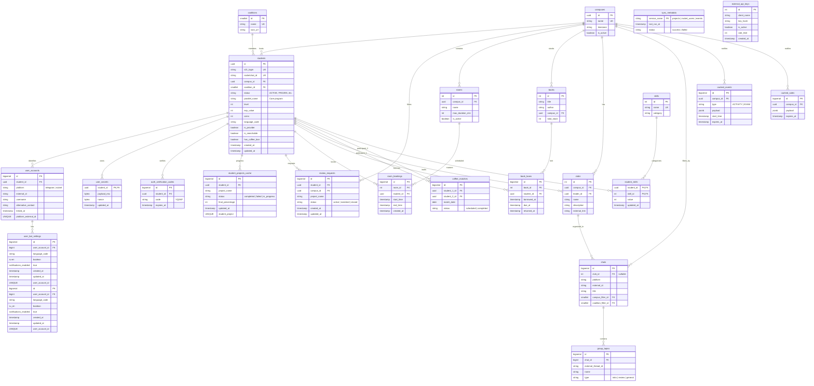

```mermaid
erDiagram
    %% =======================================================
    %% 1. IDENTITY & AUTH (Пользователи и доступ)
    %% =======================================================
    campuses {
        uuid id PK
        string name UK
        string timezone
        boolean is_active
    }

    coalitions {
        smallint id PK
        string name UK
        string icon_url
    }

    students {
        uuid id PK
        string s21_login UK
        string rocketchat_id UK
        uuid campus_id FK
        smallint coalition_id FK
        string status "ACTIVE, FROZEN, etc."
        string parallel_name "Core program"
        int level
        int exp_value
        int coins
        string language_code
        boolean is_provider
        boolean is_searchable
        boolean has_coffee_ban
        timestamp created_at
        timestamp updated_at
    }

    user_accounts {
        bigserial id PK
        uuid student_id FK
        string platform "telegram | rocket"
        string external_id
        string username
        string alternative_contact
        timestamp linked_at
        UNIQUE platform_external_id
    }

    user_bot_settings {
        bigserial id PK
        bigint user_account_id FK
        string language_code ru-en
        boolean notifications_enabled true
        timestamp created_at
        timestamp updated_at
        UNIQUE user_account_id
    }

    user_secrets {
        uuid student_id PK, FK
        bytea payload_enc
        bytea nonce
        timestamp updated_at
    }

    auth_verification_codes {
        bigserial id PK
        uuid student_id FK
        string code "YQ2KP"
        timestamp expires_at
    }

    %% =======================================================
    %% 2. OPERATIONAL CACHE (Прогресс и очереди)
    %% =======================================================
    student_projects_cache {
        bigserial id PK
        uuid student_id FK
        string project_name
        string status "completed | failed | in_progress"
        int final_percentage
        timestamp updated_at
        UNIQUE student_project
    }

    review_requests {
        bigserial id PK
        uuid student_id FK
        uuid campus_id FK
        string project_name
        string status "active | matched | closed"
        timestamp created_at
        timestamp updated_at
    }

    sync_metadata {
        string service_name PK "projects | rocket_users | events"
        timestamp last_run_at
        string status "success | failed"
    }

    %% =======================================================
    %% 3. RESOURCES (Бронирование комнат и книг)
    %% =======================================================
    rooms {
        int id PK
        uuid campus_id FK
        string name
        int max_duration_min
        boolean is_active
    }

    room_bookings {
        bigserial id PK
        int room_id FK
        uuid student_id FK
        timestamp start_time
        timestamp end_time
        timestamp created_at
    }

    books {
        int id PK
        string title
        string author
        uuid campus_id FK
        int total_stock
    }

    book_loans {
        bigserial id PK
        int book_id FK
        uuid student_id FK
        timestamp borrowed_at
        timestamp due_at
        timestamp returned_at
    }

    %% =======================================================
    %% 4. COMMUNITY & SOCIAL (Чаты, Клубы, Кофе)
    %% =======================================================
    clubs {
        int id PK
        uuid campus_id FK
        uuid leader_id FK
        string name
        string description
        string external_link
    }

    chats {
        bigserial id PK
        int club_id FK "nullable"
        string platform
        string external_id
        string title
        smallint campus_filter_id FK
        smallint coalition_filter_id FK
    }

    group_topics {
        bigserial id PK
        bigint chat_id FK
        string external_thread_id
        string name
        string type "intro | review | general"
    }

    coffee_matches {
        bigserial id PK
        uuid student_1_id FK
        uuid student_2_id FK
        date match_date
        string status "scheduled | completed"
    }

    %% =======================================================
    %% 5. SYSTEM & STATS (API и Кэш ивентов)
    %% =======================================================
    cached_events {
        bigserial id PK
        uuid campus_id FK
        string type "ACTIVITY | EXAM"
        jsonb payload
        timestamp start_time
        timestamp expires_at
    }

    cached_sales {
        bigserial id PK
        uuid campus_id FK
        jsonb payload
        timestamp expires_at
    }

    external_api_keys {
        int id PK
        string client_name
        string key_hash
        boolean is_active
        int rate_limit
        timestamp created_at
    }

    skills {
        int id PK
        string name UK
        string category
    }

    student_skills {
        uuid student_id PK, FK
        int skill_id PK, FK
        int value
        timestamp updated_at
    }

    %% =======================================================
    %% RELATIONSHIPS
    %% =======================================================
    campuses ||--o{ students : "hosts"
    coalitions ||--o{ students : "members"
    students ||--o{ user_accounts : "identifies"
    students ||--o{ user_secrets : "owns"
    students ||--o{ auth_verification_codes : "verifies"
    
    user_accounts ||--o{ user_bot_settings : "has"
    
    students ||--o{ student_projects_cache : "progress"
    students ||--o{ review_requests : "requests"
    campuses ||--o{ review_requests : "filters"
    
    campuses ||--o{ rooms : "contains"
    rooms ||--o{ room_bookings : "scheduled"
    students ||--o{ room_bookings : "books"
    
    campuses ||--o{ books : "stocks"
    books ||--o{ book_loans : "lent"
    students ||--o{ book_loans : "borrows"
    
    campuses ||--o{ clubs : "has"
    students ||--o{ clubs : "leads"
    clubs ||--o{ chats : "organized_in"
    chats ||--o{ group_topics : "contains"
    campuses ||--o{ chats : "filters_by"
    
    students ||--o{ coffee_matches : "participant_1"
    students ||--o{ coffee_matches : "participant_2"
    
    students ||--o{ student_skills : "masters"
    skills ||--o{ student_skills : "categorizes"
    
    campuses ||--o{ cached_events : "notifies"
    campuses ||--o{ cached_sales : "notifies"
    
    %% =======================================================
    %% 6. USER SETTINGS (Настройки бота)
    %% =======================================================
    user_bot_settings {
        bigserial id PK
        bigint user_account_id FK
        string language_code ru_en
        boolean notifications_enabled true
        timestamp created_at
        timestamp updated_at
        UNIQUE user_account_id
    }
```
